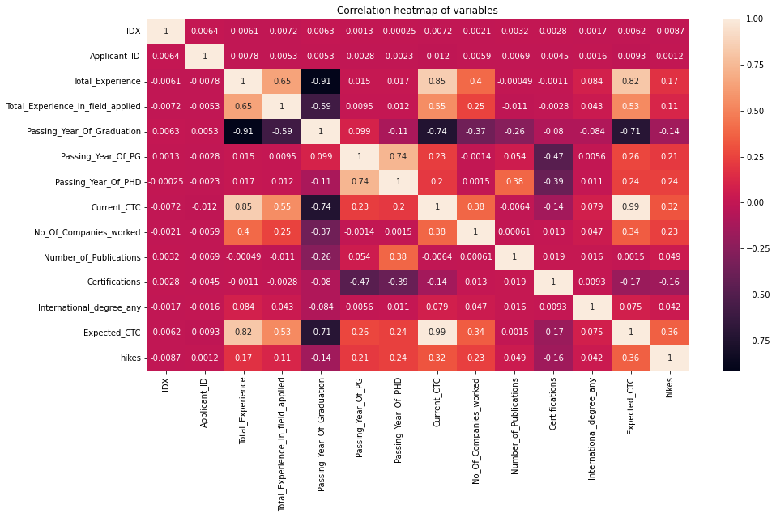

<h1 align='center'> HR data analysis </h1>
<h2 align='center'> Exploratory data analysis of HR data and predict expected salary of an employee using machine learning </h2>

 

In this repository, we have performed the end to end Exploratory Data Analysis, of available HR data and performed feature selection and feature engineering. Created multiple charts and dashboards to understand the data. Finally applied machine learning to predict the expected employee salary with the available features.

<p align='center'> 
    
</p>

----------------------------

## Approach : 

* Performed initial data cleaning like outlier removal and checked for basic `descriptive stats`. 
* Applied `Regression` and `classificaiton` algorithms to predict the missing values. 
* Perfomed `EDA` to better understand the data.
* Applied `feature selection` and `feature scaling`.
* Used `random forest regressor` and performed `hyperparameter tuning` to get R2 score of **0.89**.
------------------------------

## Why Used Plotly? 

> It gives aesthetic looking interactive charts. But its not visible in GitHub so for that you have to run the jupyter notebook

------------------------------- 

## EDA 

<p style = "display:flex"> 
    
    
</p>
<p style = "display:flex"> 
    
    
</p>
<p style = "display:flex"> 
    
    
</p>

------------------------------- 

## Document Structure 

```
HR Data Analysis 
│
|---- EDA
|   |-- *.png

|---- image
|   |-- *.png
|
|---- expected_ctc.csv
|---- hr_data_analysis.ipynb
|---- README.md
|---- requirements.txt

```
---------------------

<p align="left">
    
    
    
    
    
</p>

## Technologies used : 

* python library - numpy, pandas, seaborn, matplotlib, flask, plotly, sklearn, pickle, xgboost
* version control - git 
* concept - Machine Learning

## Tools and Services : 
* IDE - Vs code 
* Code Repository - GitHub

-----------------------
<br>

# If you Liked this project the you can consider connecting with me:
* [LinkedIn](https://www.linkedin.com/in/soumyadip-ghorai/) 

* You can find my other projects and EDAs on [Kaggle](https://www.kaggle.com/soumyadipghorai)
